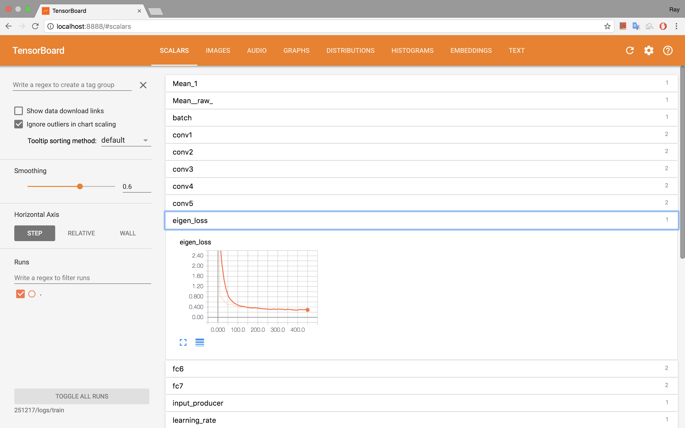

# Human Depth Inference with Deep Neural Networks

Implementation of monocular depth estimation using Convolutional Neural Networks.


## Getting Started

These instructions will get you up and running on your local machine for development and testing purposes.

### Prerequisites

1. CUDA 8.0
2. cuDNN 5.1
3. Tensorflow 1.2 for GPU
4. Pillow - python library

<!-- *Note that calibration was done using MATLAB's stereo calibration tool by using frames captured from the Kinect v2 by* `multiframe_listener.py` *by cropping and flipping the RGB. Calibration is done for a resolution of 1304x1080.* -->

### Data

Mount training data to `/mnt/sdb1`
```
sudo mount /dev/sdb1 /mnt/sdb1
```
Note, this is only to ensure the file paths in the train/test file are coherent. For instance, try running:



```
head train_100.csv
```

To see something like:

 `/mnt/sdb1/shared/RGB/83/crops/22892.jpg,/mnt/sdb1/shared/depth/83/aligned/22891.png`


### Get the source code


1. Clone the repository:
```
git clone https://github.com/ray13z/cnn_depth_tensorflow.git
```
2. Enter directory:
```
cd cnn_depth_tensorflow
```
3. Switch to branch ‘human_trials’:
```
git checkout human_trials
```
4. Check if pre-requisites are installed by running
```
python train.py —help
```


# Training
```
python train.py --train_file=train_100.csv
```
Please check the help for more options.

# Tracking progress with Tensorboard
```
tensorboard --logdir=<date>/logs/train --port=8888
```
Where the `logdir` is the log directory - this can be set while calling `train.py`. Then navigate to `localhost:8888` and you can access the dashboard which looks like:



### Author

**[Rayner Vaz](https://github.com/ray13z)**
